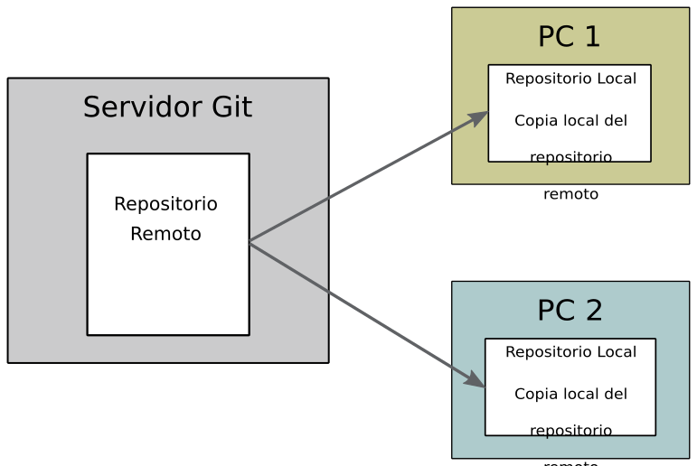

Git: primeros pasos
*******************
Git es un software de **control de versiones** de código abierto y libre, diseñado por `Linus Torvalds <https://es.wikipedia.org/wiki/Linus_Torvalds>`__ quien, también, creó Linux.

Un software de **control de versiones** gestiona los diversos cambios que se realizan en los ficheros fuente de un programa (aunque es extensible a todo tipo de proyectos donde se usen ficheros).

Dicho sistema te permite regresar a versiones anteriores de tus archivos, regresar a una versión anterior del proyecto completo, comparar cambios a lo largo del tiempo, ver quién modificó por última vez algo que pueda estar causando problemas, ver quién introdujo un problema y cuándo, y mucho más. Usar un sistema de control de versiones también significa generalmente que si arruinas o pierdes archivos, será posible recuperarlos fácilmente.

En la página web de Git tienes toda la información y documentación que necesitas: `documentación de Git <http://git-scm.com/doc>`__.

También tienes un libro online oficial de Git: `libro online <http://git-scm.com/book/es/v2>`__

En los siguientes apartados tienes una breve introducción a Git, no obstante, ante cualquier duda o consulta siempre tienes el libro online que te acabo de señalar.

¿Cómo funciona Git?
===================
Los repositorios Git suelen encontrarse en un servidor que los aloja (**repositorio remoto**). A partir de ahí, los desarrolladores, que trabajan en un mismo proyecto, bajan una copia del repositorio a su ordenador (**repositorio local**), hacen los cambios que tengan que hacer en local y los suben al repositorio remoto para que dichos cambios estén disponibles para los demás desarrolladores.

Eso no quita que puedas usar Git en modo local, sin subirlo a ningún repositorio remoto.

.. important::
    Un repositorio no es más que un carpeta preparada con Git. Dentro de esa carpeta puedes usar todos los comandos de Git.

Los tres estados de Git
-----------------------
Así pues, cuando tienes que trabajar en un proyecto lo harás en tu copia local. Esta copia local puede encontrarse en alguno de **los tres estados de Git**, que son:

**Confirmado** (*committed*): los datos están almacenados de forma segura en tu copia local.

**Modificado** (*modified*): significa que has hecho cambios que no están confirmados.

**Preparado** (*staged*): significa que has marcado un archivo modificado en su versión actual para que vaya a tu próxima confirmación.

Ramas
-----
Sin entrar en muchos detalles, en Git puedes crear varias ramas de manera que tendrás una rama principal, normalmente llamada *main*, donde tienes los cambios principales y creas otras ramas para ir añadiendo nuevas funcionalidades o que usas para corregir *bugs*, por ejemplo.

Así, si tienes un *bug* que impide a los usuario iniciar sesión correctamente podrías crear una rama llamada, por ejemplo, *bugInicioSesion*, hacer las correcciones necesarias y, cuando esté corregido, mezclas la rama *bugInicioSesion* en la rama *main*.

Primeros pasos con Git: configuración
=====================================
Antes de usar por primera vez Git tienes que personalizar tu entorno:

**Tu identidad**: tienes que establecer tu nombre y tu dirección de correo electrónico:

.. code-block:: console

    $ git config --global user.name "Román Martínez"
    $ git config --global user.email "rgmf@riseup.net"

**Tu editor**: será el editor que se abra cuando sea necesario:

.. code-block:: console

    $ git config --global core.editor nano

**Rama por defecto**: configura el nombre de la rama principal que se va a usar por defecto:

.. code-block:: console

    $ git config --global init.defaultBranch main

.. important:: 
    En este módulo SIEMPRE vamos a usar el **main** como nombre de la rama principal de todos los proyectos con Git.

Para conocer la configuración de Git puedes usar el siguiente comando:

.. code-block:: console

    $ git config --list

Comandos básicos de Git
=======================

En este apartado tienes una selección de opciones con los que trabajar en un repositorio local con Git.

Comenzar un proyecto
---------------------
Para iniciar un repositorio de Git, es decir, poner un proyecto bajo el control de Git, tienes que entrar en la carpeta de tu proyecto y ejecutar el siguiente comando:

.. code-block:: console

    $ git init

En la carpeta del proyecto, se crea un directorio llamado :file:`.git` donde está toda la información que necesita el sistema Git para la gestión de los ficheros del repositorio.

Revisar el estado del repositorio local
---------------------------------------
En cualquier momento puedes revisar el estado del repositorio: qué ficheros hay confirmados, los ficheros que hay modificados, los que han sido eliminados, los que se han añadido, etc, con el comando:

.. code-block:: console

    $ git status

Ver el historial
----------------
Se usa el comando siguiente:

.. code-block:: console

    $ git log

Verás todos los commit que se han hecho, es decir, todos las instantáneas con información como la persona que hizo el commit, el día y la hora, así como el SHA-1 del commit.

Añadir cambios al estado stage
------------------------------
Ya sea porque has creado, eliminado o modificado ficheros, los cambios realizados tienen que ser añadidos al estado de *stage* (seguimiento) para poder confirmarlos después con un *commit*.

En estos casos, se usa el comando :command:`git add` indicando, mediante una ruta relativa, los ficheros que se van a añadir al estado *stage* (al seguimiento).

Por ejemplo, imagina que has creado un fichero llamado :file:`HolaMundo.java` y lo quieres añadir al seguimiento. En este caso tienes que ejecutar el siguiente comando:

.. code-block:: console

    $ git add HolaMundo.java

Confirmar cambios (*commit*)
----------------------------
Una vez quieras confirmar los cambios de tu repositorio local tienes que ejecutar un :command:`git commit`.

Todos los cambios que estén en el *stage* (seguimiento) van a ser confirmados. Se debe incluir un mensaje corto que describa los cambios que van a ser confirmados. Un ejemplo:

.. code-block:: console

    $ git commit -m "Cambios realizados: este es el mensaje de esta confirmación o commit, escribe lo que quieras."

Si tu mensaje va a ser un poco más largo, puedes ejecutar el commit tal que así: :command:`git commit`. En este caso Git abrirá el editor de textos que configuraste anteriormente para que puedas escribir un mensaje de varias líneas.
